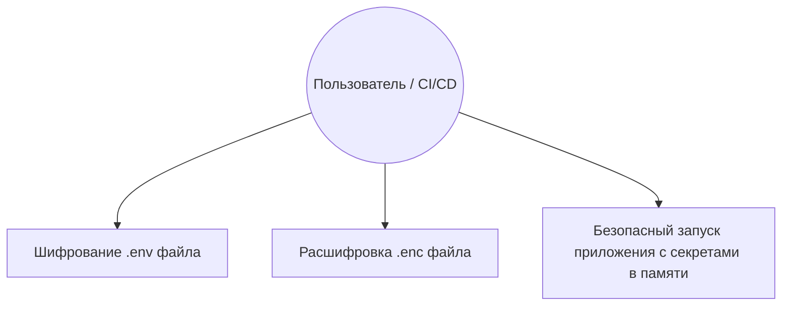
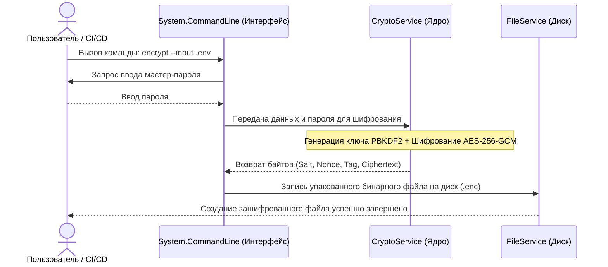

# Отчет по Контрольной точке №1: Проектирование и Старт

**Название проекта:** SecretGuard  
**Команда / Разработчик:** (Индивидуальный разработчик)

---

## 1. Архитектурный план и концепция

* **Цель сервиса:** Утилита решает задачу безопасного обмена и хранения чувствительных данных (переменных окружения, токенов, паролей), исключая их утечку в публичные репозитории. Она позволяет зашифровать файлы конфигурации локально с помощью мастер-ключа и безопасно передавать их в оперативную память процессов в пайплайнах CI/CD или при локальном старте.
* **Целевой интерфейс:** CLI (Консольный интерфейс командной строки).
* **Выбранный стек:** C# (.NET 8), CLI-фреймворк `System.CommandLine`, криптографическое ядро `System.Security.Cryptography (AesGcm)`, система логирования `Serilog`.

---

## 2. Проектирование (UML-диаграммы / Mermaid)

### Диаграмма вариантов использования (Use Case)

### Диаграмма последовательности (Sequence) взаимодействия модулей

---

## 3. Распределение ролей

*Разработка ведется в индивидуальном формате.*

* **Студент:** Александр
* **Роль:** Fullstack CLI / DevOps Инженер
* **Зона ответственности:** Проектирование архитектуры команд, разработка криптографического модуля, организация файловой структуры проекта, конфигурация правил контроля версий и сборка Native AOT релизов.

---

## 4. Чек-лист готовности

* [x] Создан новый публичный репозиторий на GitHub.
* [x] Все участники добавлены в репозиторий как соавторы (разработка индивидуальная).
* [x] Каждый участник сделал минимум 3 осмысленных коммита (согласно Git-политике). *Примечание: Зафиксирована стартовая структура проекта, установлены зависимости и оформлена базовая документация.*
* [x] Настроено локальное виртуальное окружение, проект запускается в базовом виде (консольный скелет приложения на платформе .NET 8 успешно компилируется, инициализирует логгер и корректно реагирует на аргументы командной строки).
